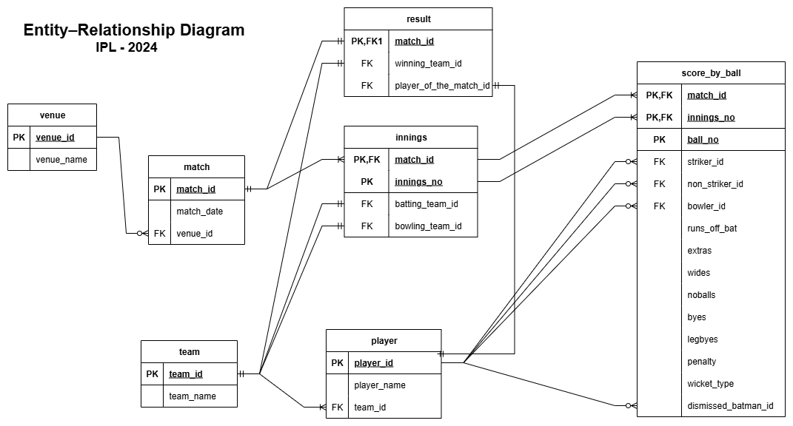

# 🏏 2024 Indian Premier League (IPL) — SQL Portfolio Project

The **Indian Premier League (IPL)** is one of the world’s most popular professional Twenty20 (T20) cricket leagues.  
For this project, I assumed the role of an **SQL Developer** working with the IPL web development team, responsible for writing SQL queries that power match summaries, player statistics, and scoreboard components for a new website.

This project is part of my **Data Analysis & SQL learning journey**, and is built using **SQLite**.

The database contains **7 normalized tables**, capturing match information, innings, players, ball-by-ball events, dismissals, and more.  
The Entity Relationship Diagram (ERD) gives a high-level overview of the data design.

---

## 📝 Entity-Relationship Diagram (ERD)

## 🎲 Project Requirements & 📸 SQL Outputs

Below are the various types of data the website needs, along with the SQL outputs I generated.

---

<pre><code>
Match Level Information Required
--------------------------------
1. Match Number
2. Venue
3. Match Date
4. Winning Team Name

</code></pre>

<pre><code>
Innings Level Information Required

1. Name of the teams played
2. Total runs scored
3. Total wickets lost
4. Total overs played

</code></pre>

<pre><code>
Batting Summary (Batsman Level) Information Required

1. Team Name
2. Batsman Name
3. Runs
4. Balls
5. 4s
6. 6s
7. Strike Rate

</code></pre>

<pre><code>
Batting Summary (Extras) Information Required

1. Team Name
2. extras
3. noballs
4. wides
5. byes
6. legbyes
7. penalities

</code></pre>

#### This output is formated in 2 different ways:

<pre><code>
Bowling Summary (Bowler Level) Information Required

1. Batting Team Name
2. Bowler Name
3. Overs
4. Runs
5. Wickets
6. Economy
7. Dots

</code></pre>

## 🧠 Skills & Concepts Demonstrated

- SQL joins (INNER, LEFT, SELF joins)
- Aggregations (SUM, COUNT, AVG)
- GROUP BY and HAVING filtering
- CASE expressions
- Calculated metrics
  - Strike Rate
  - Economy
  - Overs formatting
- Data modelling & normalization
- Cricket analytics logic
- Clean SQL formatting for real-world use cases

---

## 📌 Future Enhancements

- Add Power BI or Tableau dashboard
- Add Python notebook for further analysis
- Build a simple frontend UI showing these statistics

  <!-- SQLite Badge -->
  

  <!-- SQL Badge -->
  

  <!-- Project Type Badge -->
  

  <!-- IPL Badge -->
  

  <!-- Status Badge -->
  

